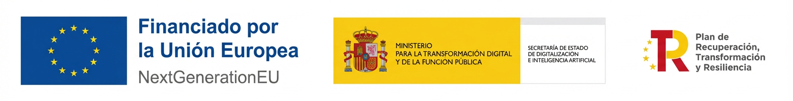

# SERESCO/CTIC RuralTech Agro Data Space

Demostrador de compartición soberana e interoperable de datos en el sector agroalimentario, basado en Eclipse Dataspace Components (EDC) y GAIA-X GXDCH.

## Qué es

- Un demostrador práctico para probar, aprender y pilotar espacios de datos con actores reales (sidra, vitivinícola, miel, cárnico, sector público, I+D).
- Construido sobre estándares abiertos: DSP/EDC para intercambio soberano, DCAT/ODRL para catálogo y políticas, SSI (DID, VC/VP) para confianza y acceso.
- Operado con un marco de gobernanza claro y una autoridad del espacio para cumplimiento y mediación.

## Para quién

- Productores, cooperativas, procesadores, distribuidores, sector público, investigación y proveedores tecnológicos—especialmente pymes y startups—para reducir riesgos de adopción y crear _data products_.

## Socios y ecosistema

- Promotor: Seresco. Tecnología/datos: CTIC RuralTech. Agregadores y líderes sectoriales de Asturias, Galicia, Cataluña y Portugal. Coordinación con el GT Agro de GAIA-X.

## Por qué importa

- Confianza, portabilidad y cumplimiento by design para desbloquear valor del dato agroalimentario con mínimo lock-in.

